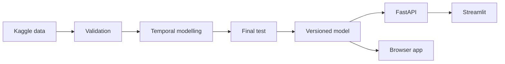

# Crop Yield Intelligence Platform

[](https://github.com/AbubakarMA/crop-yield-intelligence-platform/actions/workflows/ci.yml)

An end-to-end machine-learning system for estimating historical agricultural
yield from crop, country, weather, pesticide, and year data.

**[Open the deployed application](https://abubakarma.github.io/crop-yield-intelligence-platform/)**

## What the project demonstrates

- regression problem framing with a non-causal scope
- grain validation and duplicate resolution
- chronological train/validation/test splitting
- leakage-safe preprocessing
- benchmark, linear, positive-output, and tree-model comparison
- expanding temporal cross-validation and hyperparameter tuning
- final sealed-test evaluation and crop-level error analysis
- versioned model artifacts and metadata
- a validated FastAPI prediction contract and Streamlit API client
- an interactive browser deployment
- automated tests, linting, CI, and Docker packaging

## Final results

All model decisions were completed on 1990–2010 data before opening the
2011–2013 test period.

| Model | Purpose | Test MAE | Test RMSE | Test R² |
|---|---|---:|---:|---:|
| 300-tree unrestricted random forest | Research model | 11,065.87 hg/ha | 21,938.75 hg/ha | 0.9382 |
| 100-tree depth-18 random forest | Deployed model | 11,815.30 hg/ha | 22,615.23 hg/ha | 0.9343 |

The browser model trades about 6.8% higher MAE for a portable artifact. Both
models produced zero negative test predictions. The API and browser model
return the same estimate for the same inputs.

## Architecture



## Repository structure

```text
.
├── data/                    # Dataset documentation; local data ignored
├── docs/                    # Problem, validation, architecture, model card
├── notebooks/               # Eight reproducible analysis stages
├── scripts/                 # Browser-model export utility
├── src/crop_yield/          # Validation, modelling, training, and API code
├── tests/                   # Unit and API contract tests
├── Dockerfile
├── docker-compose.yml
├── streamlit_app.py
└── README.md
```

## Run locally

Use Python 3.11 or newer.

```bash
python -m venv .venv
source .venv/bin/activate
pip install -r requirements.txt
pip install -e .
```

Download the Kaggle data as described in [`data/README.md`](data/README.md),
then train and version the production model:

```bash
python -m crop_yield.production
```

Start the API and, in another terminal, the user interface:

```bash
uvicorn crop_yield.api:app --reload
streamlit run streamlit_app.py
```

Run quality checks:

```bash
ruff check src tests scripts
pytest -q
```

After model artifacts exist, run the full local system in containers:

```bash
docker compose up --build
```

## Responsible-use boundary

This is a historical conditional estimator, not a causal recommendation engine
or long-range forecast. Rainfall is constant through time within each country
in the source data, pesticide use is a national total rather than a per-hectare
rate, and country can proxy unmeasured technology and reporting differences.
See [`docs/model_card.md`](docs/model_card.md) for the full evaluation.

## Data source

[Crop Yield Prediction Dataset on Kaggle](https://www.kaggle.com/datasets/patelris/crop-yield-prediction-dataset).
The data retain their own licence and are not committed to this repository.

## Author

**Abubakar Mamudu Alutiba**  
Crop and Soil Sciences graduate and data analyst pursuing an MSc in Financial
Engineering.

## Licence

Project code is available under the [MIT License](LICENSE).
