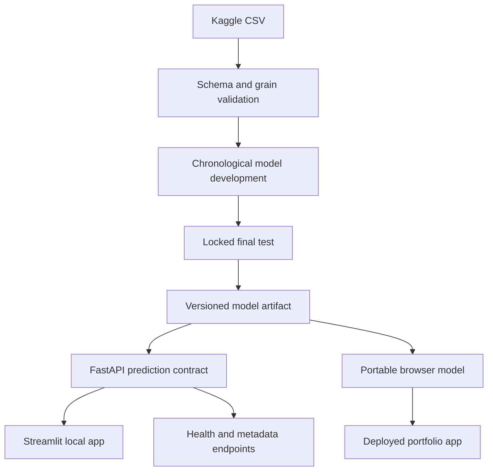

# Production architecture

## Separation of responsibilities

- `data.py` establishes a trustworthy country–crop–year table.
- `splitting.py` prevents future years from leaking into training.
- `preprocessing.py` owns category encoding and numeric transformations.
- `models.py` defines reproducible candidates.
- `production.py` performs final evaluation, refitting, and artifact creation.
- `api.py` validates requests and serves predictions through a stable contract.
- `streamlit_app.py` is a thin client of the API.
- The deployed web experience runs the portable depth-capped forest directly
  in the browser and exposes its limitations beside every estimate.
